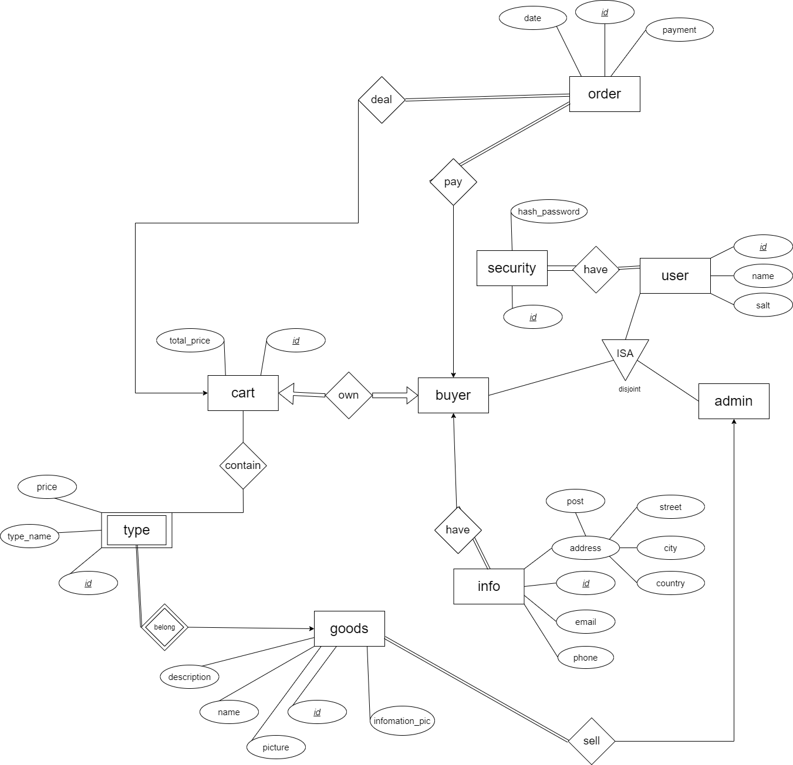

# DBMS Project 23F 
> 数据库期末大作业
## 假设
这个项目由于时间和人力等多方面因素，有部分设计依赖于特殊假设：
- 管理员仅有三个,不可通过网页注册增加
- 不对用户的信息(地址,邮箱等)真实性进行检验
- 商品生产迅速,无需考虑库存
- 如到支付阶段,支付过程均假设成功,并完成订单
- 仅管理员可查看订单历史与详情
- 购物车不支持部分购买
- 不对sql注入和越权行为进行大量的设计和保护
- 后端允许跨域(作业提交的缘故)

## 数据库设计

### ER图设计


### 逻辑设计
- buyer = (***buyer_id***, ***buyer_name***, buyer_salt, cart_id)
- admin = (***admin_id***, ***admin_name***, admin_salt)
- security_with_admin=(***security_id***, ***admin_id***,hash_password)
- security_with_buyer=(***security_id***, ***buyer_id***,hash_password)
- orders=(***order_id***,date,payment,cart_id,buyer_id)
- admin_view_order=(***admin_id***,***order_id***)
- info=(***info_id***,buyer_id,post,street,city,country,email,phone)
- goods=(***goods_id***,goods_name,goods_description,goods_pic,goods_information_pic)
- goods_type=(***goods_type_id***,goods_id,goods_type_name,price)
- cart_contain_goods_type=(***cart_id***,***goods_type_id***)
- cart=(***cart_id***,buyer_id,total_price)

### 3NF化简
- buyer = (***buyer_id***, ***buyer_name***, buyer_salt, cart_id)
- admin = (***admin_id***, ***admin_name***, admin_salt)
- security_with_admin=(***admin_id***,hash_password)
- security_with_buyer=(***buyer_id***,hash_password)
- orders=(***order_id***,date,payment,cart_id)
- admin_view_order=(***admin_id***,***order_id***)
- info=(***buyer_id***,post,street,city,country,email,phone)
- goods=(***goods_id***,goods_name,goods_description,goods_pic,goods_information_pic)
- goods_type=(***goods_type_id***,goods_id,goods_type_name,price)
- cart_contain_goods_type=(***cart_id***,***goods_type_id***)
- cart=(***cart_id***,total_price)

## 数据库建立

### 建表与主键约束
```sql
CREATE TABLE buyer (
    buyer_id VARCHAR(255),
    buyer_name VARCHAR(255),
    buyer_salt VARCHAR(255),
    cart_id VARCHAR(255),
    PRIMARY KEY (buyer_id, buyer_name)
);

CREATE TABLE admin (
    admin_id VARCHAR(255),
    admin_name VARCHAR(255),
    admin_salt VARCHAR(255),
    PRIMARY KEY (admin_id, admin_name)
);

CREATE TABLE security_with_admin (
    admin_id VARCHAR(255) PRIMARY KEY,
    hash_password VARCHAR(255)
);

CREATE TABLE security_with_buyer (
    buyer_id VARCHAR(255) PRIMARY KEY,
    hash_password VARCHAR(255)
);

CREATE TABLE orders (
    order_id VARCHAR(255) PRIMARY KEY,
    order_date DATE,
    payment VARCHAR(255),
    cart_id VARCHAR(255)
);

CREATE TABLE admin_view_order (
    admin_id VARCHAR(255),
    order_id VARCHAR(255),
    PRIMARY KEY (admin_id, order_id)
);

CREATE TABLE info (
    buyer_id VARCHAR(255) PRIMARY KEY,
    post VARCHAR(255),
    street VARCHAR(255),
    city VARCHAR(255),
    country VARCHAR(255),
    email VARCHAR(255),
    phone VARCHAR(255)
);

CREATE TABLE goods (
    goods_id VARCHAR(255) PRIMARY KEY,
    goods_name VARCHAR(255),
    goods_description VARCHAR(255), 
    goods_pic VARCHAR(255),
    goods_information_pic VARCHAR(255)
);

CREATE TABLE goods_type (
    goods_type_id VARCHAR(255) PRIMARY KEY,
    goods_id VARCHAR(255),
    goods_type_name VARCHAR(255),
    price DECIMAL(10, 2)
);

CREATE TABLE cart_contain_goods_type (
    cart_id VARCHAR(255),
    goods_type_id VARCHAR(255),
    PRIMARY KEY (cart_id, goods_type_id)
);

CREATE TABLE cart (
    cart_id VARCHAR(255) PRIMARY KEY,
    total_price DECIMAL(10, 2)
);
```

### 外键约束
```sql
ALTER TABLE buyer
ADD FOREIGN KEY (cart_id) REFERENCES cart(cart_id);

ALTER TABLE security_with_admin
ADD FOREIGN KEY (admin_id) REFERENCES admin(admin_id);

ALTER TABLE security_with_buyer
ADD FOREIGN KEY (buyer_id) REFERENCES buyer(buyer_id);

ALTER TABLE orders
ADD FOREIGN KEY (cart_id) REFERENCES cart(cart_id);

ALTER TABLE admin_view_order
ADD FOREIGN KEY (admin_id) REFERENCES admin(admin_id),
ADD FOREIGN KEY (order_id) REFERENCES orders(order_id);

ALTER TABLE info
ADD FOREIGN KEY (buyer_id) REFERENCES buyer(buyer_id);

ALTER TABLE goods_type
ADD FOREIGN KEY (goods_id) REFERENCES goods(goods_id);

ALTER TABLE cart_contain_goods_type
ADD FOREIGN KEY (cart_id) REFERENCES cart(cart_id),
ADD FOREIGN KEY (goods_type_id) REFERENCES goods_type(goods_type_id);
```

### trigger约束
- 添加商品时的价格范围约束
```sql

```

- order形成时清空cart_contain_goods_type中对应cart_id的商品,同时清空cart的total_price
```sql
CREATE TRIGGER clear_cart_and_goods
AFTER INSERT ON orders
FOR EACH ROW
BEGIN
    DELETE FROM cart_contain_goods_type
    WHERE cart_id = NEW.cart_id;
    
    UPDATE cart
    SET total_price = 0
    WHERE cart_id = NEW.cart_id;
END;
```
- 添加cart_contain_goods_type时增加对应的cart中的total_price
```sql
CREATE TRIGGER update_cart_total_price
AFTER INSERT ON cart_contain_goods_type
FOR EACH ROW
BEGIN
    DECLARE goods_price DECIMAL(10, 2);
    SELECT price INTO goods_price
    FROM goods_type
    WHERE goods_type_id = NEW.goods_type_id;
    
    UPDATE cart
    SET total_price = total_price + goods_price
    WHERE cart_id = NEW.cart_id;
END;
```


## 功能设计

### 登录
- 接受一个post请求
- 参数：`username`, `password`, `is_admin`
- 如果`is_admin`为`true`
    - 从`admin`表中取出`admin_name=username`的`admin_id`和`admin_salt`
    - 将`password+admin_salt`进行md5加密得到`secret_password`
    - 检测`secret_password`是否等于`security_with_admin`表中`admin_id=admin_id`的`hash_password`
- 否则同理从`buyer`表取出并同理检测md5是否等于`sercurity+with_buyer`中的`hash_password` 

### 注册
<!-- TODO 暂时不支持管理员注册,以后可以改成管理员邀请注册制功能 -->
- 接受一个post请求
- 参数：`buyer_name`, `password`
- 先检测`buyer_name`是否已存在,如存在返回信息
- 如不存在,根据雪花算法依照时间戳生成`buyer_id`
- 随机生成一个`salt`,将`buyer_id`, `username`, `salt`存入`buyer`表中
- 然后将`password+salt`进行md5加密得到`secret_password`和`buyer_id`存入`security_with_buyer`中

### 商品展示
- 接收 GET 请求参数：`category`（类别）、`keyword`（关键字）、`page`（页码，默认为1）、`limit`（每页显示数量，默认为9）
- 构造查询语句获取总记录数
- 根据请求参数构造查询条件，并将条件添加到查询语句中
- 执行查询获取总记录数
- 计算偏移量,并构造带 LIMIT 和 OFFSET 的查询语句
- 如果存在查询结果：
  - 创建一个空数组 `goods` 存储查询结果
  - 遍历结果集，将每一行数据添加到 `goods` 数组中
  - 构造返回的 JSON 数据，包括 `data`（商品数组）、`page`（当前页码）、`limit`（每页显示数量）、`totalCount`（总记录数
  - 将数组转换为 JSON 字符串
  - 输出 JSON 字符串作为响应
- 如果查询结果为空：
  - 返回一个空数组的 JSON 字符串，包括 `data`（空数组）、`page`（当前页码）、`limit`（每页显示数量）、`totalCount`（总记录数）

### 商品详情
- 获取 GET 请求参数 `goodsId`
- 查询商品详情，构造查询语句并执行查询
- 查询商品类型信息，构造查询语句并执行查询
- 创建空数组 `response` 存储返回的数据
- 检查商品详情查询结果是否存在
   - 如果存在,提取商品详情数据，包括 `category`、`description`、`information`、`image`、`name`，添加到 `response` 数组中
   - 如果不存在查询结果，表示未找到对应商品
- 检查商品类型信息查询结果是否存在
   - 如果存在查询结果：
     - 创建空数组 `typeData` 存储商品类型数据
     - 遍历结果集，将每一行数据添加到 `typeData` 数组中
     - 将 `typeData` 数组添加到 `response` 数组中，使用键名 `type`。
- 转换 `response` 数组为 JSON 字符串
 
### 添加购物车

- 接收 GET 请求参数 `goods_type_id`和`buyer_id`
- 通过`buyer_id`查询`buyer`表，获取`cart_id`
- 根据`cart_id`给`cart_contain_goods_type `添加`goods_type_id`
- 此时`trigger`自动给`cart`的`total_price`增加

### 查询购物车

- 接收 GET 请求参数 `buyer_id`
- 通过`buyer_id`查询`buyer`表，获取`cart_id`
- 查询`cart_contain_goods_type`表，获取`goods_type_id`
- 查询`goods_type`表，获取`goods_type_name`和`price`
- 查询`cart`获取`total_price`


### 删除购物车商品

- 接收 GET 请求参数 `goods_type_id`和`buyer_id`
- 通过`buyer_id`查询`buyer`表，获取`cart_id`
- 删除`cart_contain_goods_type`表对应的`goods_type_id`
- trigger自动更新`cart`的`total_price`

### 产生订单
<!-- TODO 当前的购买只能购买全部商品 -->
- 接收 GET 请求参数 `buyer_id`
- 通过`buyer_id`查询`buyer`表，获取`cart_id`
- 获取cart的total_price作为payment生成order
- 同时trigger自动清空

### 修改用户信息

- 接受一个post请求,包含参数`buyer_id`,`post`,`street`,`city``,country`,`email`,`phone`
- 检查参数是否完整
- 检查参数是否符合格式
- 查询info表
- 如果不存在则插入
- 否则更新

### 获取用户信息

- 接受一个get请求,包含参数`buyer_id`
- 查询info表并返回

### 查询订单历史(管理员)
<!-- TODO -->

### 商品增加(管理员)
<!-- TODO -->